# Density Dwarf (PSZ Sketch)

A Phantom Star Zero inspired game with modern web technologies and cryptographic authentication.

[](https://starlight.astro.build)

## ✨ Features

### 🔐 Cryptographic Authentication
- **Zero-friction onboarding**: No passwords, no sign-ups, just play
- **ECDSA P-256**: Modern elliptic curve cryptography
- **Non-extractable keys**: Secure key storage in IndexedDB
- **Challenge-response**: Prevents replay attacks
- **JWT sessions**: Stateless authentication

### 📚 Documentation Site
Built with Astro Starlight for comprehensive game documentation:
- Architecture diagrams (Mermaid)
- Screen flow documentation
- Mechanics and game systems
- API contracts

### 🎮 Game Systems
- Character creation and management
- Quest system
- Storage and inventory
- Shops and crafting

## 🚀 Quick Start

```bash
# Install dependencies
npm install

# Start development server
npm run dev

# Visit the title screen
# Open http://localhost:4321/title
```

## 🏗️ Project Structure

```mermaid
graph TD
    root["/"]

    root --> docs["docs/<br/><small>Additional documentation</small>"]
    root --> public["public/<br/><small>Static assets</small>"]
    root --> src["src/<br/><small>Source code</small>"]
    root --> config["astro.config.mjs<br/><small>Astro configuration</small>"]

    docs --> auth_doc["AUTHENTICATION.md"]
    docs --> test_doc["test-results.md"]
    docs --> arch_dir["architecture/<br/><small>Mermaid diagrams</small>"]

    public --> logo["logo.svg"]
    public --> screenshots["screenshots/"]
    public --> assets_img["assets/img/<br/><small>logo.png</small>"]

    src --> assets["assets/<br/><small>Images & media</small>"]
    src --> components["components/<br/><small>React components</small>"]
    src --> content["content/<br/><small>Starlight docs</small>"]
    src --> layouts["layouts/<br/><small>Page layouts</small>"]
    src --> lib["lib/<br/><small>Client libraries</small>"]
    src --> mod["mod/<br/><small>Server libraries</small>"]
    src --> pages["pages/<br/><small>Routes & endpoints</small>"]

    components --> comp_title["title/<br/><small>SpaceScene.tsx</small>"]
    components --> comp_docs["docs/<br/><small>MermaidDiagram.tsx</small>"]

    lib --> auth_client["authService.ts<br/><small>Client auth flow</small>"]
    lib --> key_mgr["keyManager.ts<br/><small>Key generation & storage</small>"]

    mod --> server_crypto["serverCrypto.ts<br/><small>JWT & signature verification</small>"]
    mod --> server_storage["serverStorage.ts<br/><small>In-memory storage</small>"]

    pages --> api["api/<br/><small>API endpoints</small>"]
    pages --> title_page["title.astro<br/><small>Title screen</small>"]
    pages --> sync_page["sync.astro<br/><small>Asset sync screen</small>"]
    pages --> diagrams["diagrams/<br/><small>Mermaid diagram pages</small>"]

    api --> challenge["challenge.ts<br/><small>POST /api/challenge</small>"]
    api --> authenticate["authenticate.ts<br/><small>POST /api/authenticate</small>"]

    style root fill:#e1f5ff
    style src fill:#fff3e0
    style lib fill:#e8f5e9
    style mod fill:#fce4ec
    style components fill:#f3e5f5
    style pages fill:#fff9c4
```



### Key Directories

- **`src/lib/`** - Client-side libraries (browser APIs: IndexedDB, Web Crypto, sessionStorage)
- **`src/mod/`** - Server-side libraries (Node.js: crypto, JWT signing)
- **`src/components/`** - Feature-organized React components (title/, docs/)
- **`src/pages/api/`** - Server API endpoints (challenge, authenticate)

## 🧞 Commands

All commands are run from the root of the project, from a terminal:

| Command                   | Action                                           |
| :------------------------ | :----------------------------------------------- |
| `npm install`             | Installs dependencies                            |
| `npm run dev`             | Starts local dev server at `localhost:4321`      |
| `npm run build`           | Build your production site to `./dist/`          |
| `npm run preview`         | Preview your build locally, before deploying     |
| `npm run astro ...`       | Run CLI commands like `astro add`, `astro check` |
| `npm run astro -- --help` | Get help using the Astro CLI                     |

## 👀 Want to learn more?

Check out [Starlight’s docs](https://starlight.astro.build/), read [the Astro documentation](https://docs.astro.build), or jump into the [Astro Discord server](https://astro.build/chat).

## 🔐 Authentication System

The game uses a modern cryptographic authentication system:

### How It Works

1. **Key Generation**: ECDSA P-256 key pair generated on first visit
2. **Fingerprint**: 40-character ID derived from public key hash
3. **Challenge-Response**: Server sends challenge, client signs it
4. **JWT Token**: Server verifies signature and issues JWT

### Security Features

- ✅ Non-extractable keys (stored in IndexedDB)
- ✅ Challenge expiry (2 minutes)
- ✅ Single-use challenges (replay attack prevention)
- ✅ Fingerprint verification
- ✅ Zero security vulnerabilities (CodeQL scan)

See [docs/AUTHENTICATION.md](docs/AUTHENTICATION.md) for complete documentation.

## 📖 Documentation

Visit the documentation site for:
- [Architecture Overview](src/content/docs/architecture/overview.md)
- [Title Screen](src/content/docs/screens/title-screen.md)
- [System Architecture](docs/architecture/system-architecture.mmd)
- [Data Flow](docs/architecture/data-flow.mmd)

## 🧪 Testing

Test results: [docs/test-results.md](docs/test-results.md)

## 🔧 Technology Stack

- **Framework**: [Astro](https://astro.build) v5.15.2
- **Documentation**: [Starlight](https://starlight.astro.build)
- **Authentication**: Web Crypto API (ECDSA P-256)
- **Storage**: IndexedDB (client), In-memory (server demo)
- **Sessions**: JWT with jsonwebtoken
- **Adapter**: @astrojs/node (SSR)

## 🛡️ Security

- **CodeQL Scan**: 0 vulnerabilities
- **Non-extractable Keys**: Private keys cannot be exported
- **Challenge-Response**: Prevents replay attacks
- **Short-lived Challenges**: 2-minute expiry
- **JWT Expiry**: 1 hour default
