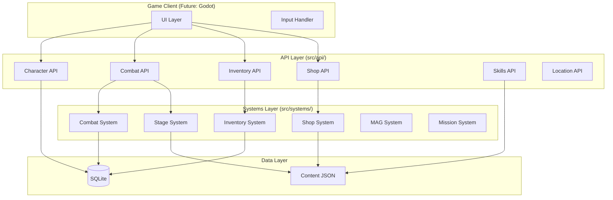
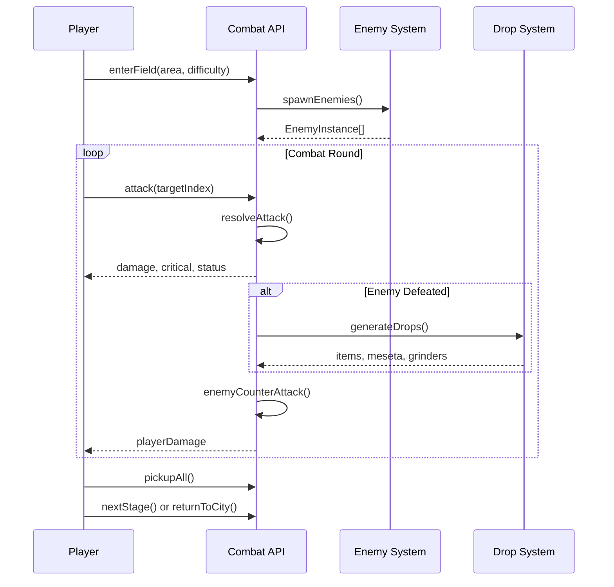
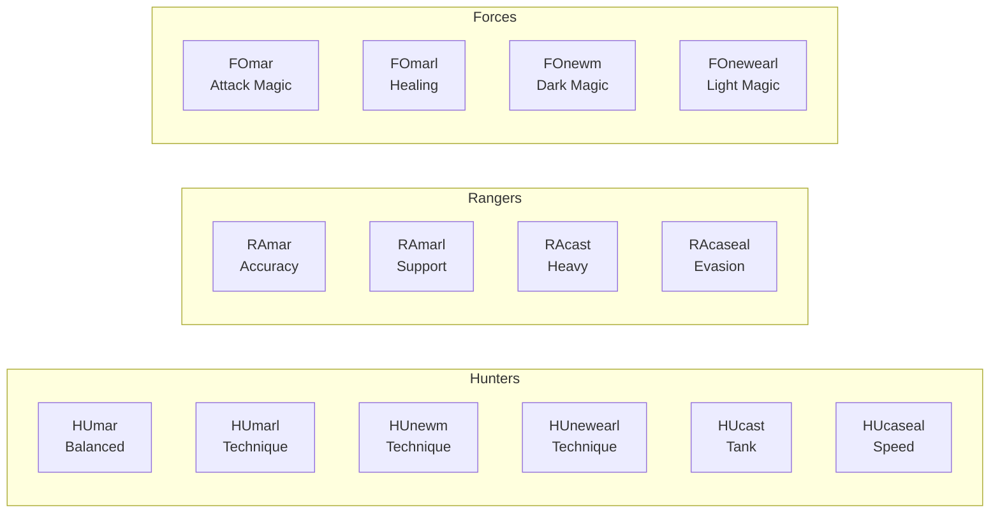
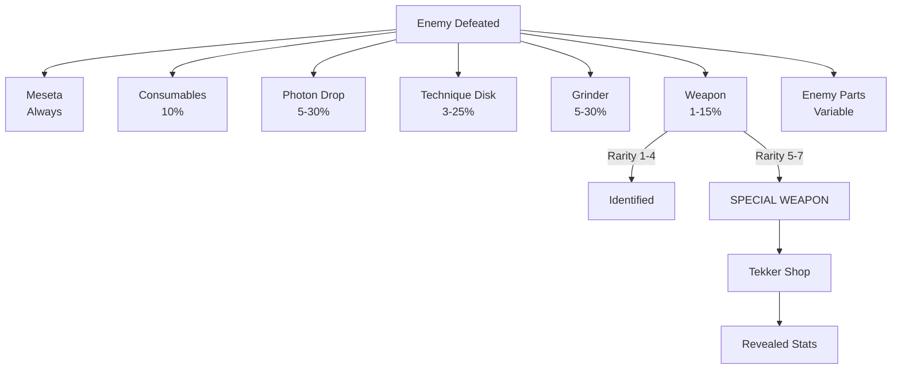

# Density Dwarf (PSZ Sketch)

A Phantasy Star Zero inspired action RPG with complete game systems implemented as a testable API layer, ready for Godot engine transition.

## Game Systems Overview

This project implements the core gameplay systems of a PSZ-style action RPG. All systems are fully functional and tested via a SQLite-backed API layer.

### Implemented Systems

| System | Status | Description |
|--------|--------|-------------|
| Character Creation | ✅ | 12 classes (HU/RA/FO × Human/Newman/Cast), 4 save slots |
| Combat System | ✅ | Attacks, criticals, accuracy vs evasion, status effects |
| Inventory | ✅ | 40-slot inventory, stacking, equipment management |
| Equipment | ✅ | Weapons, armor (frames), units (1-4 slots) |
| Techniques | ✅ | 17 techniques, class limits, disk learning system |
| Photon Arts | ✅ | Weapon-type specific skills with PP cost |
| Shops | ✅ | Item shop, Weapon shop, Tech shop, Tekker |
| Enemies | ✅ | 65+ enemies across 7 areas with drops |
| Missions | ✅ | 15 missions with objectives, grades, rewards |
| MAG System | ✅ | Feeding, evolution (3 stages), stat bonuses |
| Status Effects | ✅ | Freeze, stun, poison, slow, paralysis, burn |
| Grinding | ✅ | Grinder items (+1/+2/+3), Tekker shop |
| Special Weapons | ✅ | 5-7★ weapons drop unidentified, require appraisal |
| Storage | ✅ | Shared storage across characters |

## Architecture


```mermaid
graph TB
    subgraph "Game Client (Future: Godot)"
        UI[UI Layer]
        Input[Input Handler]
    end

    subgraph "API Layer (src/api/)"
        CharAPI[Character API]
        CombatAPI[Combat API]
        InvAPI[Inventory API]
        ShopAPI[Shop API]
        SkillAPI[Skills API]
        LocAPI[Location API]
    end

    subgraph "Systems Layer (src/systems/)"
        Combat[Combat System]
        Stage[Stage System]
        Shop[Shop System]
        Inv[Inventory System]
        Mag[MAG System]
        Mission[Mission System]
    end

    subgraph "Data Layer"
        DB[(SQLite)]
        Content[Content JSON]
    end

    UI --> CharAPI
    UI --> CombatAPI
    UI --> InvAPI
    UI --> ShopAPI

    CharAPI --> DB
    CombatAPI --> Combat
    CombatAPI --> Stage
    InvAPI --> Inv
    ShopAPI --> Shop
    SkillAPI --> Content

    Combat --> DB
    Stage --> Content
    Shop --> Content
    Inv --> DB
```

## Combat Flow


```mermaid
sequenceDiagram
    participant P as Player
    participant C as Combat API
    participant E as Enemy System
    participant D as Drop System

    P->>C: enterField(area, difficulty)
    C->>E: spawnEnemies()
    E-->>C: EnemyInstance[]

    loop Combat Round
        P->>C: attack(targetIndex)
        C->>C: resolveAttack()
        C-->>P: damage, critical, status

        alt Enemy Defeated
            C->>D: generateDrops()
            D-->>C: items, meseta, grinders
        end

        C->>C: enemyCounterAttack()
        C-->>P: playerDamage
    end

    P->>C: pickupAll()
    P->>C: nextStage() or returnToCity()
```

## Class System


```mermaid
graph LR
    subgraph Hunters
        HUmar[HUmar<br/>Balanced]
        HUmarl[HUmarl<br/>Technique]
        HUnewm[HUnewm<br/>Technique]
        HUnewearl[HUnewearl<br/>Technique]
        HUcast[HUcast<br/>Tank]
        HUcaseal[HUcaseal<br/>Speed]
    end

    subgraph Rangers
        RAmar[RAmar<br/>Accuracy]
        RAmarl[RAmarl<br/>Support]
        RAcast[RAcast<br/>Heavy]
        RAcaseal[RAcaseal<br/>Evasion]
    end

    subgraph Forces
        FOmar[FOmar<br/>Attack Magic]
        FOmarl[FOmarl<br/>Healing]
        FOnewm[FOnewm<br/>Dark Magic]
        FOnewearl[FOnewearl<br/>Light Magic]
    end
```

## Areas & Bosses

| Area | Boss | Enemy Types |
|------|------|-------------|
| Gurhacia Valley | Reyburn | Native, Beast |
| Rioh Snowfield | Hildegao (wave) | Native, Beast |
| Ozette Wetland | Octo Diablo | Native, Beast |
| Oblivion City Paru | Chaos & Mobius | Native, Machine |
| Makara Ruins | Rohcrysta | Native, Beast |
| Arca Plant | Blade Mother | Machine |
| Dark Shrine | Dark Falz | Dark |

## Drop System


```mermaid
graph TD
    Enemy[Enemy Defeated]

    Enemy --> Meseta[Meseta<br/>Always]
    Enemy --> Consumable[Consumables<br/>10%]
    Enemy --> Photon[Photon Drop<br/>5-30%]
    Enemy --> Disk[Technique Disk<br/>3-25%]
    Enemy --> Grinder[Grinder<br/>5-30%]
    Enemy --> Weapon[Weapon<br/>1-15%]
    Enemy --> Parts[Enemy Parts<br/>Variable]

    Weapon --> |"Rarity 1-4"| Identified[Identified]
    Weapon --> |"Rarity 5-7"| Special[SPECIAL WEAPON]
    Special --> Tekker[Tekker Shop]
    Tekker --> Revealed[Revealed Stats]
```

## Project Structure

```
src/
├── api/              # Game API layer
│   ├── character.ts  # Character CRUD, leveling
│   ├── combat.ts     # Combat, attacks, enemies
│   ├── equipment.ts  # Equip/unequip items
│   ├── inventory.ts  # Item management
│   ├── location.ts   # Navigation, sessions
│   ├── shop.ts       # Buy/sell items
│   ├── skills.ts     # Techniques, Photon Arts
│   ├── storage.ts    # Shared storage
│   ├── tekker.ts     # Grinding, identification
│   └── progression.ts # Materials, set bonuses
├── systems/          # Game logic
│   ├── combat/       # Damage, accuracy, status
│   ├── inventory/    # Item types, starting gear
│   ├── mag/          # MAG evolution, feeding
│   ├── mission/      # Objectives, rewards
│   ├── shop/         # Shop inventories
│   └── stage/        # Enemy pools, spawning
├── content/          # Game data (JSON)
│   ├── enemies/      # 65+ enemy definitions
│   ├── weapons/      # 300+ weapons
│   ├── armors/       # Armor definitions
│   ├── classes/      # Class stats & limits
│   ├── missions/     # 15 mission definitions
│   ├── drops/        # Drop tables by difficulty
│   └── mags/         # MAG evolution data
├── db/               # SQLite database
└── components/       # React components (Storybook)
```

## Quick Start

```bash
# Install dependencies
npm install

# Run tests
npm test

# Start development server (Storybook)
npm run dev

# View enemy gallery
open http://localhost:4321/storybook/enemies
```

## API Examples

### Create Character
```typescript
import { createCharacter } from './src/api/character';

const result = createCharacter(0, 'HUmar', 'Kireek');
// { success: true, data: { id: '...', name: 'Kireek', class_id: 'HUmar', level: 1 } }
```

### Combat Flow
```typescript
import { enterField, spawnEnemies, attack, pickupAll } from './src/api';

enterField(charId, 'gurhacia', 'normal');
spawnEnemies(charId, 'gurhacia', 'normal', 1, 1);
attack(charId, 0); // Attack first enemy
pickupAll(charId); // Collect drops
```

### Equipment
```typescript
import { equipWeapon, equipFrame, equipUnit } from './src/api/equipment';

equipWeapon(charId, 'saber_123');
equipFrame(charId, 'frame_456');
equipUnit(charId, 'knight-power'); // Auto-assigns to available slot
```

## Database Schema

All game state is persisted in SQLite:

- `characters` - Character data, class, level, meseta
- `inventory` - Items owned by characters
- `equipment` - Equipped items per character
- `game_state` - Location, combat, session data
- `storage_items` - Shared storage items
- `material_bonuses` - Permanent stat bonuses

## Testing

```bash
# Run all tests
npm test

# Run specific test file
npx vitest run src/api/combat.ts

# Run with coverage
npx vitest run --coverage
```

## Godot Transition

The API layer is designed for easy integration with Godot:

1. **GDScript bindings** - API functions map directly to game actions
2. **JSON serialization** - All data structures are JSON-compatible
3. **SQLite** - Native Godot SQLite plugin available
4. **Event-driven** - Combat results return all needed display data

## Technology Stack

- **Runtime**: Node.js / Bun
- **Database**: SQLite (better-sqlite3)
- **Testing**: Vitest
- **UI Preview**: Astro + React (Storybook)
- **3D Models**: Three.js (enemy gallery)
- **Target Engine**: Godot 4.x

## License

MIT
